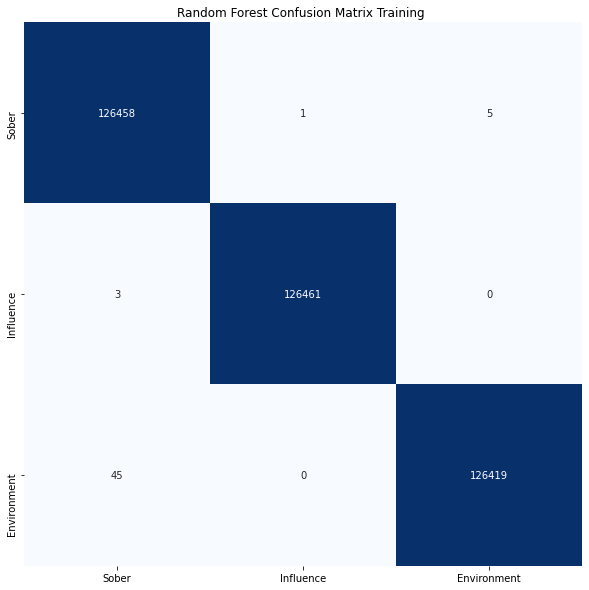

# Primary Cause of Chicago Car Accidents

Using the OSEM process we will build a classifier to predict the primary contributory cause of a car accident, given information about the car, people and road condition. We are building this model in the hope of reducing traffic accidents by observing interesting patterns. 

This will be an unbalanced multi-class classification problem; because of this we will be trimming a substantial amount and binning out target classes.

# Obtaining and Scrubbing

  
Click to read about getting and cleaning the data! 

  
  ## Obtaining
  * We have gathered the data from https://data.cityofchicago.org/Transportation/Traffic-Crashes-Vehicles/68nd-jvt3
     
     
  ## Scrubbing
  * We have used several different methods to clean the data:
      1. Missing data:
          * There was plenty of missing data in this dataset; some variables/columns more than others.
          * Columns that were deemed essential, to building a good model, had missing value were carefully investigated and replaced with corresponding values; (if need be dropped)
      2. Place holders:
          * Some variable/columns had plenty of values that did not make logical sense (could've been used as a placeholder or human mistake)
          * Place holders were replaced, if available and need for a model, else they were dropped.
      3. Unique variable:
          * There were very important columns that were needed for the model building; though a portion of their variables was "UNKNOWN" or "NOT APPLICABLE"
          * After carefully investigating; we divided the data of unknowns (to use for our successful model late) and dropped/replaced not applicable values
      4. Datatypes:
          * Before going forward with the data, the different types of variables datatypes is explored and appropriately reassigned to the correct datatype for modeling

# Explore

  
Click to read about exploration of the data! 

  
  ## Exploring
  * While exploring the data, there are some noticeable variables that impact the primary cause of accidents more than others.
  * To get a better understanding of the best features in the dataset, performing a SelectKBest appropriately shows the best correlations between the features and target (a primary cause of the accident)
  
  
  
  
  
  

    
  *  According to the SelectKBest the best features for our model would be:
      * Weather Condition
      * Road Way Surface Condition
      * Crash Type
   
   

  
     
        
        

# Model

  
Click to read about modeling the data! 

  
  ## Modeling
  * To model our data effectively; we must first use SMOTE
      * We use SMOTE to deal with the imbalance of target/classes; meaning that the amount of times each target is shown is unbalanced
  * Once we SMOTE our data, we will fit our clean data unto different models and review each of their confusion matrices and classification report
  * Before beginning modeling we must **bin** our target variables into manageable amounts for the model to understand, therefore we have binned out target classes into:
      * Sober 
      * Influenced (alcohol/drugs/etc)
      * Environment
  * With this completed we will now use the best model and hyper tuned the parameters to try to produce better results for our test set
  * Once that is complete, the model is trained, tunned and able to produce the best results out of our other variables
  
  

# Interpert

  
Click to read about interperting our results! 

  
  ## Interpreting the results
  * The way to interpret the results, is by reviewing the confusion matrices and classification report of both the training and testing data. 
  * The confusion matrices tells us the amount the model was able to predict correctly (sober, influenced, environment) and the amount of the model predicted incorrectly resulting in false positive/false negative results
  
     
     
    
    
    
    * As you can see there the diagonal boxes (from left to right) show the true positive predictions (meaning that the model predicted them and it was correct)
    * The other boxes predict the different false positive/false negative depending in accordance to the values you look at
  

# Future Work

  
Click to future work for analysis! 

  
  ## Future work for Chicago Car Crashes
  
  * Obtain more clean data (especially of smaller value class) in order for the models to train better and become more accurate
  * Create an additional model for each corresponding binned class to use to be able to predict the true original target/class

# Final Project Submission

* Student name: Alisa Radjabova
* Student pace: full time
* Scheduled project review date/time: 
* Instructor name: Rafael
* Blog post URL: https://aradjabova.github.io/multi-class_classification_-_power_of_bins
* Presentation: Case study.pdf
* Notebooks: https://colab.research.google.com/drive/16MELNTjcsR9bTu4jv_80CuMwJZNHfkFU

